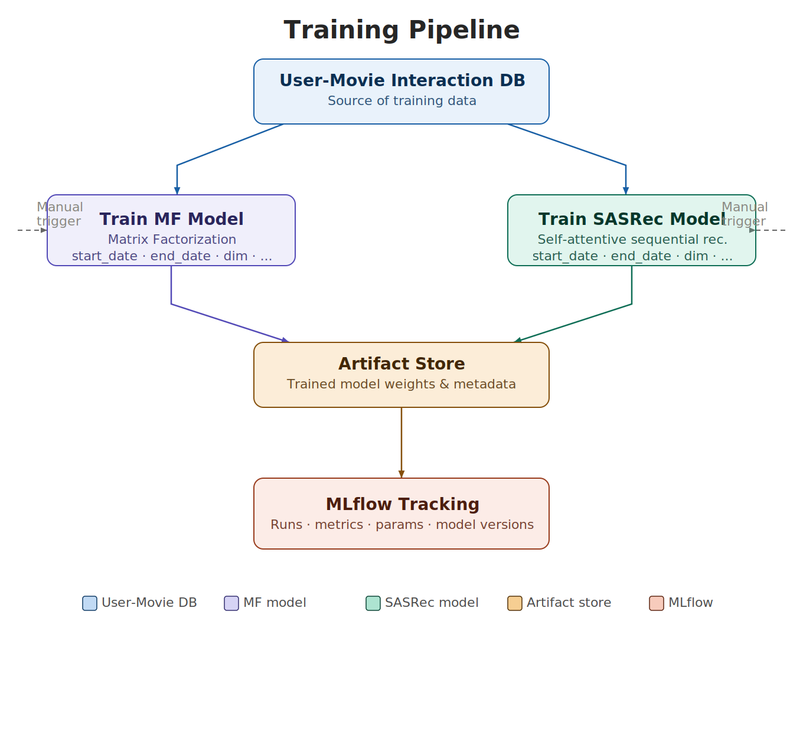
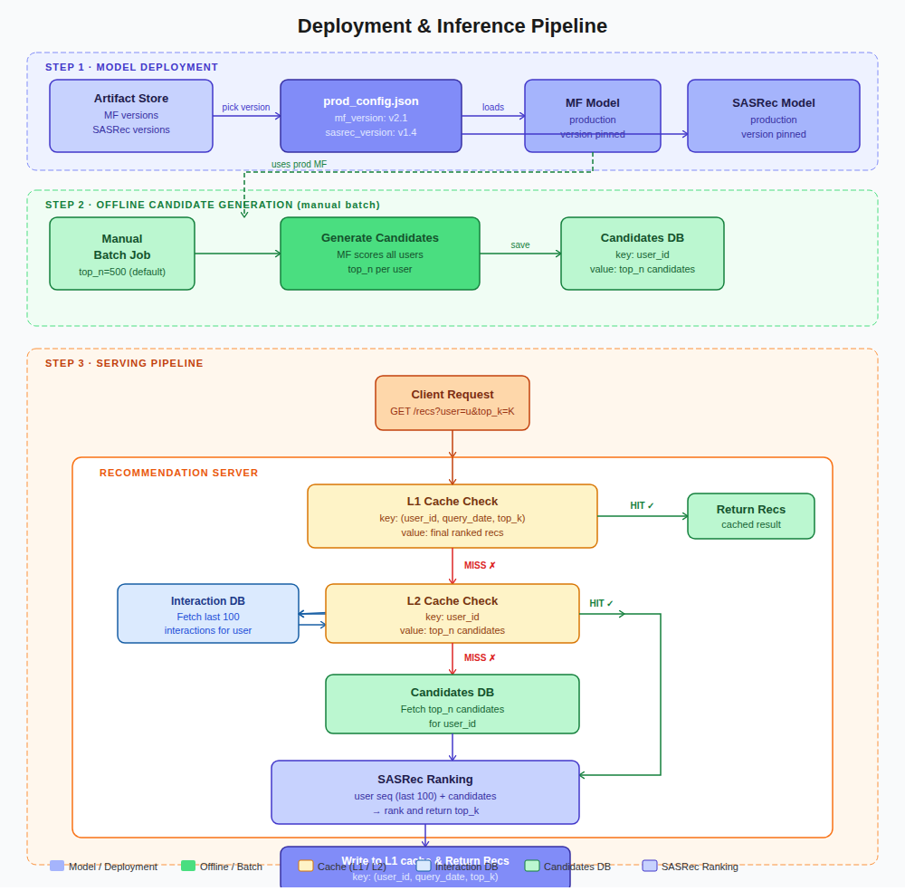

# Movie Recommendation System
This project builds a production-grade movie recommendation system on the MovieLens 32M dataset (~32M ratings, ~200K users, ~87K movies). Stage 1 uses Matrix Factorisation (BPR/MSE, SGD) to retrieve a personalised candidate pool offline. Stage 2 uses SASRec — a self-attentive sequential model — to re-rank candidates at serve time using the user's real interaction history. The full system ships with an MLflow experiment tracker, a manual model promotion workflow, SQLite-backed offline candidate storage, a FastAPI inference server, and a two-level TTL cache (L1: output cache, L2: candidate cache) that cuts mean latency from 65ms → 5.7ms at 92.6% L1 hit rate.

***

## Table of Contents

- [Data](#data)
- [Project Structure](#project-structure)
- [Setup](#setup)
- [DB Simulator](#db-simulator)
- [Experiment Tracking](#experiment-tracking)
- [Stage 1 — Matrix Factorisation](#stage-1--matrix-factorisation)
- [Stage 2 — SASRec](#stage-2--sasrec-sequential-recommendation)
- [Deployment](#deployment)
- [Serving Pipeline](#serving-pipeline)
- [Latency Benchmark](#latency-benchmark)
- [Run Naming Convention](#run-naming-convention)

***

## Data

The project uses the **MovieLens 32M** dataset — ~32 million ratings by ~200,000 users on ~87,000 movies.

| File | Columns |
|---|---|
| `ratings.csv` | `userId`, `movieId`, `rating` (0.5–5.0), `timestamp` |
| `movies.csv` | `movieId`, `title`, `genres` (pipe-separated) |
| `links.csv` | `movieId` → IMDb/TMDb ID |

### Download

```bash
bash data_download.sh
```

Downloads and unzips the dataset into `data/ml-32m/`.

***

## Project Structure

```
recommendation_system/
├── data/
│   ├── ml-32m/                          ← MovieLens dataset
│   └── candidates.db                    ← Pre-computed MF candidates (SQLite)
├── src/
│   ├── data/
│   │   ├── db_simulator.py              ← MovieLensDB wrapper
│   │   └── candidates_db.py             ← CandidatesDB read/write abstraction
│   ├── training/
│   │   ├── matrix_factorisation.py      ← MF with MSE/BPR loss (SGD)
│   │   ├── sasrec_architecture.py       ← SASRec + SASRecWithGenre definitions
│   │   └── sasrec.py                    ← SASRec training + evaluation
│   ├── tracking/
│   │   ├── tracker.py                   ← ExperimentTracker (MLflow wrapper)
│   │   └── config.py                    ← Experiment names
│   ├── artifacts/
│   │   └── local_store.py               ← LocalArtifactStore
│   ├── deploy/
│   │   ├── promote.py                   ← Promote MLflow runs to prod_config.json
│   │   └── generate_candidates.py       ← Offline MF candidate generation
│   ├── serving/
│   │   ├── utils.py                     ← Artifact loaders + cache helpers
│   │   └── app.py                       ← FastAPI serving endpoints
│   └── test/
│       └── test_latency.py              ← Sequential latency benchmark
├── results/
│   ├── training_pipeline.png            ← Training pipeline HLD
│   └── inference_pipeline.png          ← Inference pipeline HLD
├── mlruns/                              ← MLflow artifact store (auto-created, gitignored)
├── prod_config.json                     ← Active production model versions
├── run_mf.sh                            ← Shell script to train MF
├── run_sasrec.sh                        ← Shell script to train SASRec
|── run_app.sh                           ← Shell script to launch serving API
├── data_download.sh
├── pyproject.toml
└── README.md
```

***

## Setup

### 1. Install dependencies

```bash
pip install -r requirements.txt
```

### 2. Install the project as an editable package

```bash
pip install -e .
```

This registers `src` as a package so all `src.*` imports work from anywhere — no `sys.path` hacks needed.

### 3. Download data

```bash
bash data_download.sh
```

***

## DB Simulator

`src/data/db_simulator.py` wraps the raw CSVs in a `MovieLensDB` class with query-like methods.

```python
from src.data.db_simulator import MovieLensDB

db = MovieLensDB()
db.load_data()

db.get_active_users("2018-01-01", "2018-06-30", min_ratings=10)
db.get_popular_movies(top_n=50)
db.get_ratings_by_daterange("2018-01-01", "2018-06-30")

# Genre one-hot (12-dim) for a single movie
db.get_genre_vector(movie_id=1)              # np.ndarray (12,)

# Batch genre vectors for a sequence (0 → zero vector for padding)
db.get_genre_vectors_batch([1, 2, 0, 3])    # np.ndarray (4, 12)

# User interaction history up to a simulation date
db.get_user_history(user_id=42, as_of_date="2018-07-15", limit=200)
# → list of {movie_id, rating, timestamp}, ordered most-recent first
```

**Genre vocabulary (fixed order, index 0–11):**
```
Action, Thriller, Sci-Fi, Horror, Romance, Drama,
Adventure, Documentary, Crime, Comedy, Mystery, Children
```

`src/data/candidates_db.py` wraps `data/candidates.db` — the SQLite store for pre-computed MF candidates.

```python
from src.data.candidates_db import CandidatesDB

with CandidatesDB() as cdb:
    cdb.user_exists(user_id=42)                        # bool
    cdb.get_candidates(user_id=42, top_n=500)          # list[dict] — personal candidates
    cdb.get_global_candidates(top_n=500)               # list[dict] — popularity fallback
```

**Schema:**

| Table | Columns | Description |
|---|---|---|
| `candidates` | `user_id, movie_id, mf_score, rank` | Per-user top-N from MF |
| `global_candidates` | `movie_id, rank` | Global popular fallback for new/cold-start users |

***

## Experiment Tracking

All training runs are tracked with **MLflow** via `ExperimentTracker`.

```bash
# Launch the MLflow UI (separate terminal)
mlflow ui --port 5001
# → http://localhost:5001
```

Each run logs:

| What | Detail |
|---|---|
| **Params** | All hyperparameters |
| **Metrics** | `train_loss` per epoch + eval metrics at final epoch |
| **Tags** | `model_type`, `n_users`, `n_items`, `training_time_sec` |
| **Artifacts** | Model weights, encoder, args, loss curve |

> `mlruns/` is gitignored — never commit it.

***

## Stage 1 — Matrix Factorisation

`src/training/matrix_factorisation.py` — SGD-based MF with MSE or BPR loss. Supports user/item bias terms.

```bash
# Recommended
bash run_mf.sh

# Custom config
python src/training/matrix_factorisation.py \
    --start 2016-01-01 --end 2018-06-30 \
    --eval_start 2018-07-01 --eval_end 2018-12-31 \
    --loss bpr --dim 64 --lr 0.01 --epochs 20
```

### Arguments

| Argument | Default | Description |
|---|---|---|
| `--start` | required | Training window start `YYYY-MM-DD` |
| `--end` | required | Training window end `YYYY-MM-DD` |
| `--eval_start` | required | Eval window start `YYYY-MM-DD` |
| `--eval_end` | required | Eval window end `YYYY-MM-DD` |
| `--loss` | `bpr` | `bpr` or `mse` |
| `--dim` | `64` | Embedding dimension |
| `--lr` | `0.01` | Learning rate |
| `--reg1` | `0.01` | Regularisation for P, Q |
| `--reg2` | `0.01` | Regularisation for biases |
| `--epochs` | `20` | Training epochs |
| `--min_rating` | `3.0` | Minimum rating to treat as positive |
| `--min_u_rat` | `10` | Min ratings per user (co-filtering) |
| `--min_i_rat` | `10` | Min ratings per item (co-filtering) |
| `--eval_k` | `5 10 20` | K values for Recall / NDCG |
| `--top_n_recs` | `50` | Top-N recommendations per user |
| `--min_eval_ratings` | `5` | Min GT ratings to qualify a user |

### MLflow Run Name
```
mf_bpr_dim64
mf_mse_dim128
```

### Artifacts (stored in MLflow)
```
encoder.pkl          ← user/item index mappings
args.pkl             ← all hyperparameters
user_embeddings.npy
item_embeddings.npy
user_bias.npy
item_bias.npy
mu.npy               ← global mean
loss_curve.png
```

### Eval Metrics (logged to MLflow)
```
recall_at_5_min5      ndcg_at_5_min5
recall_at_10_min5     ndcg_at_10_min5
n_users_min5
```

***

## Stage 2 — SASRec (Sequential Recommendation)

`src/training/sasrec.py` — Self-Attentive Sequential Recommendation. Two variants:

- **SASRec** — item ID embeddings only
- **SASRecWithGenre** — item ID + 12-dim genre one-hot fused via a learned linear projection

```bash
# Base SASRec
bash run_sasrec.sh

# With genre fusion
bash run_sasrec.sh --use_genre

# Custom config
python src/training/sasrec.py \
    --start 2016-01-01 --end 2018-06-30 \
    --eval_start 2018-07-01 --eval_end 2018-12-31 \
    --loss bce --dim 64 --n_layers 2 --n_heads 2 \
    --max_len 200 --epochs 30 --lr 0.001 --use_genre
```

### Arguments

| Argument | Default | Description |
|---|---|---|
| `--start` | required | Training window start `YYYY-MM-DD` |
| `--end` | required | Training window end `YYYY-MM-DD` |
| `--eval_start` | required | Eval window start `YYYY-MM-DD` |
| `--eval_end` | required | Eval window end `YYYY-MM-DD` |
| `--loss` | `bce` | `bce` or `bpr` |
| `--dim` | `64` | Embedding dimension |
| `--n_layers` | `2` | Transformer encoder layers |
| `--n_heads` | `2` | Attention heads (`dim % n_heads == 0`) |
| `--max_len` | `200` | Max sequence length (left-padded) |
| `--lr` | `0.001` | Learning rate (100-step linear warmup) |
| `--epochs` | `30` | Training epochs |
| `--batch_size` | `256` | Batch size |
| `--n_neg` | `4` | Negative samples per positive |
| `--min_rating` | `3.0` | Minimum rating to treat as positive |
| `--min_u_rat` | `10` | Min ratings per user (co-filtering) |
| `--min_i_rat` | `10` | Min ratings per item (co-filtering) |
| `--eval_k` | `5 10 15 20` | K values for Recall / NDCG / HitRate |
| `--top_n_recs` | `50` | Top-N recs for Recall / NDCG eval |
| `--min_eval_ratings` | `10` | Min GT ratings to qualify a user |
| `--use_genre` | `False` | Enable 12-dim genre fusion |
| `--n_genres` | `12` | Genre vocabulary size |

### MLflow Run Name
```
sasrec_bce_dim64
sasrec_bpr_dim64_genre
```

### Artifacts (stored in MLflow)
```
model.pt         ← trained model weights (PyTorch state_dict)
encoder.pkl      ← user/item index mappings
args.pkl         ← all hyperparameters
loss_curve.png
```

### Eval Metrics (logged to MLflow)
```
recall_at_5_min10      ndcg_at_5_min10
recall_at_10_min10     ndcg_at_10_min10
n_users_min10

hit_rate_at_5          ← sequential next-item prediction
hit_rate_at_10
```

#### HitRate@K — Sequential Next-Item

For each user, the model slides forward through their eval interactions:

```
Train history:  [i1, ..., i50]
Eval window:    [i51, i52, ..., i61]

Step 1: seq=[i1...i50]   → predict top-K → hit if i51 ∈ top-K
Step 2: seq=[i1...i51]   → predict top-K → hit if i52 ∈ top-K
...

hit_rate@K = total hits / total prediction steps
```

Items not present in the encoder (unseen during training) are skipped.

***

## Deployment

## Training Pipeline

<p align="center">
  
</p>

Deployment is a two-step manual process: **model promotion** followed by **offline candidate generation**.

### Step 1 — Promote Models to Production

`src/deploy/promote.py` writes the chosen MLflow run IDs into `prod_config.json`, which acts as the single source of truth for which model versions are live.

```bash
# Promote MF model
python src/deploy/promote.py --model mf --run_id <mf_run_id>

# Promote SASRec model
python src/deploy/promote.py --model sasrec --run_id <sasrec_run_id>

# Promote both at once
python src/deploy/promote.py --model mf --run_id <mf_run_id> \
                              --model sasrec --run_id <sasrec_run_id>

# Inspect current production config
python src/deploy/promote.py --show
```

This creates / updates `prod_config.json`:

```json
{
  "mf": {
    "run_id": "3f2a1bc...",
    "run_name": "mf_bpr_dim64",
    "train_end": "2018-06-30",
    "params": { ... },
    "promoted_at": "2024-01-15 10:30:00"
  },
  "sasrec": {
    "run_id": "9e1d4fa...",
    "run_name": "sasrec_bce_dim64",
    "train_end": "2018-06-30",
    "params": { ... },
    "promoted_at": "2024-01-15 10:31:00"
  }
}
```

### Step 2 — Generate Candidates Offline

`src/deploy/generate_candidates.py` reads the promoted MF run from `prod_config.json`, scores all unseen items for every user, and writes the top-N candidates to `data/candidates.db`.

```bash
# Default top-500 candidates per user
python src/deploy/generate_candidates.py

# Custom top-N
python src/deploy/generate_candidates.py --top_n 300
```

**Scoring formula:**

```
score(u, i) = P[u] · Q[i] + b_i[i]
```

User bias `b_u` is excluded — it is a constant per user and does not affect item ranking.

**Cold-start users** (not present in the MF encoder) automatically receive the global top-N popular items from the training window as their candidate pool.

| Argument | Default | Description |
|---|---|---|
| `--top_n` | `500` | Top-N candidates per user |
| `--batch_size` | `1000` | Users per SQLite insert batch |

***

## Serving Pipeline
<p align="center">
  
</p>

The serving layer is a **FastAPI** application (`src/serving/app.py`) backed by two artifact stores and a two-level in-memory cache.

### Start the Server

```bash
# GPU inference, cache ON (default)
export SASREC_RUN_ID=<sasrec_run_id>
./scripts/serve.sh

# Force CPU
./scripts/serve.sh --cpu

# Custom port
./scripts/serve.sh --port 8001

# Disable cache (for benchmarking)
CACHE_ENABLED=0 ./scripts/serve.sh
```

### Environment Variables

| Variable | Default | Description |
|---|---|---|
| `SASREC_RUN_ID` | required | MLflow run ID for the SASRec model |
| `CANDIDATES_DB` | `data/candidates.db` | Path to the candidates SQLite DB |
| `FORCE_CPU` | `0` | Set to `1` to disable CUDA |
| `CACHE_ENABLED` | `1` | Set to `0` to disable both cache levels |
| `CANDIDATE_CACHE_SIZE` | `5000` | Max entries in L2 candidate cache |
| `CANDIDATE_CACHE_TTL` | `3600` | L2 TTL in seconds |
| `OUTPUT_CACHE_SIZE` | `10000` | Max entries in L1 output cache |
| `OUTPUT_CACHE_TTL` | `600` | L1 TTL in seconds |

### API Endpoints

| Method | Endpoint | Description |
|---|---|---|
| `GET` | `/health` | Server status + active device |
| `GET` | `/recommendations/{user_id}` | Top-N recommendations for a user |
| `GET` | `/next-item/{user_id}` | Single most likely next item |
| `GET` | `/cache/stats` | L1 / L2 hit-miss counters and hit rate % |
| `GET` | `/cache/clear` | Reset both caches (use between benchmark runs) |

**Query parameters for `/recommendations` and `/next-item`:**

| Parameter | Default | Description |
|---|---|---|
| `as_of_date` | today | Simulation date `YYYY-MM-DD` — history is built up to this date |
| `top_n` | `10` | Number of results to return |

**Example request:**
```bash
curl "http://localhost:8000/recommendations/42?as_of_date=2018-07-15&top_n=10"
```

**Example response:**
```json
{
  "user_id": 42,
  "as_of_date": "2018-07-15",
  "cached": false,
  "latency_ms": 63.4,
  "results": [
    {"movie_id": 318, "sasrec_score": 4.821, "rank": 1},
    {"movie_id": 296, "sasrec_score": 4.710, "rank": 2}
  ]
}
```

### Request Pipeline

```
Request (user_id, as_of_date, top_n)
        │
        ├─ L1 hit  (key: user_id + as_of_date + top_n)  →  return immediately
        │
        └─ L1 miss
              │
              ├─ L2 hit  (key: user_id)  →  skip DB, go straight to SASRec
              │
              └─ L2 miss  →  CandidatesDB read  →  store in L2
                                    │
                                    ▼
                         build user sequence from MovieLensDB
                         (chronological, truncated to max_seq_len)
                                    │
                                    ▼
                         SASRec forward pass
                         score(u, i) = h_u[-1] · item_emb[i]
                                    │
                                    ▼
                         store in L1  →  return top-N
```

**Cold-start users** (not in `candidates.db`) are served the global popular fallback, cached under a shared sentinel key `__global_popular__` so all new users share one L2 entry rather than each occupying a slot.

***

## Latency Benchmark

`src/test/test_latency.py` replays a full month of interactions as a sequential request stream against the live server and measures per-request latency.

### Methodology

- Takes a month (e.g. `2018-07`) and filters all interactions within that window
- Builds a **globally chronological** request list: `(user_id, as_of_date)` sorted by actual interaction timestamp — each request receives only the history the user had up to that moment
- Fires all requests sequentially against `GET /recommendations/{user_id}`
- Reports **P50, P95, P99** and mean latency using server-reported `latency_ms` (excludes network overhead)
- Results are appended to `results/latency_benchmark_{month}.csv` so all conditions accumulate in one file

```bash
# Run benchmark (server must be running separately)
python src/test/test_latency.py --month 2018-07 --top_n 10

# Custom server port
python src/test/test_latency.py --month 2018-07 --base_url http://localhost:8001
```

Run once per condition by restarting the server with different env vars:

```bash
FORCE_CPU=0 CACHE_ENABLED=1 ./scripts/serve.sh   # GPU  + cache ON
FORCE_CPU=0 CACHE_ENABLED=0 ./scripts/serve.sh   # GPU  + cache OFF
FORCE_CPU=1 CACHE_ENABLED=1 ./scripts/serve.sh   # CPU  + cache ON
FORCE_CPU=1 CACHE_ENABLED=0 ./scripts/serve.sh   # CPU  + cache OFF
```

### Results — July 2018 (112,659 requests, top_n=10)

| Condition | Requests | P50 (ms) | P95 (ms) | P99 (ms) | Mean (ms) | L1 Hit % | L2 Hit % |
|---|---|---|---|---|---|---|---|
| CPU \| cache=OFF | 112,659 | 65.437 | 68.508 | 69.342 | 65.008 | 0.0% | 0.0% |
| CPU \| cache=ON | 112,659 | 0.006 | 67.416 | 104.203 | 5.738 | 92.6% | 74.0% |

**Key observations:**

- **Cache OFF**: Every request hits the full pipeline (DB → SASRec inference). Tight P50→P99 spread of ~4ms reflects consistent CPU inference time at ~65ms per request.
- **Cache ON**: 92.6% of requests are L1 hits — served in **0.006ms** (pure dict lookup). The chronological replay means the same `(user_id, as_of_date)` key recurs naturally, resulting in a high hit rate. Mean latency drops from 65ms to 5.7ms.
- **P99 increase with cache ON** (104ms vs 69ms): The ~1% of cold L1+L2 misses pay a one-time overhead for both DB read and cache write on top of SASRec inference. This is a first-access tax, not a recurring cost — async cache writes can eliminate it if needed.

***

## Run Naming Convention

MLflow run names follow the pattern:

```
{model}_{loss}_dim{d}[_genre]

mf_bpr_dim64
mf_mse_dim128
sasrec_bce_dim64
sasrec_bpr_dim64_genre
```

When multiple runs exist for the same config, the MLflow UI sorts by start time — the most recent run is at the top.
